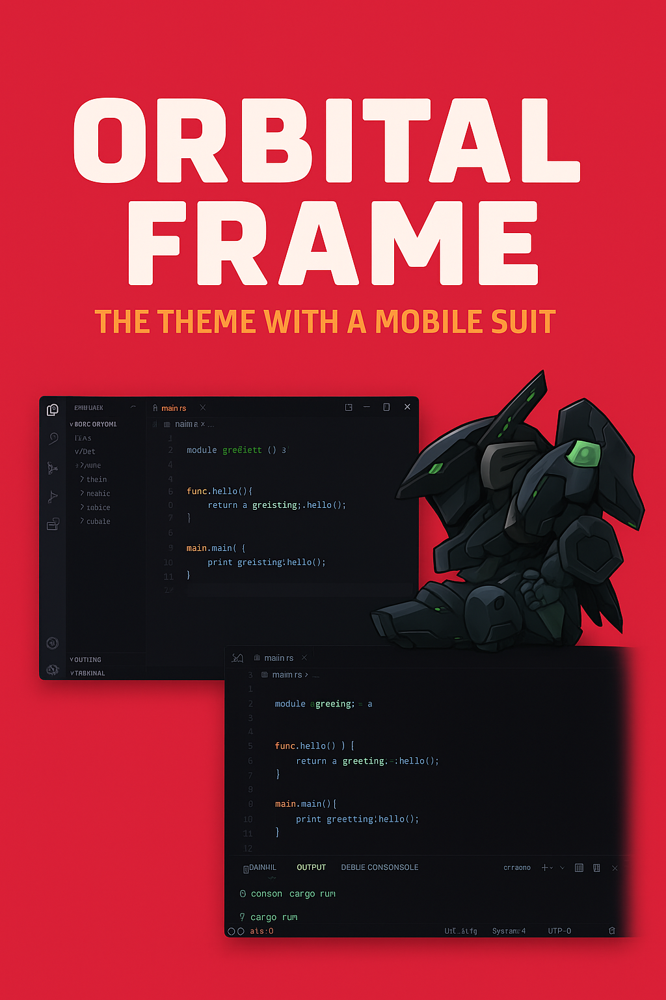

# Orbital Frame Themes for VS Code

A collection of VS Code themes inspired by the legendary Orbital Frames from Zone of the Enders. Each theme captures the essence and visual identity of these iconic mechas with both dark and light variants.

## 🚀 Available Themes

### Jehuty
The hero's frame - clean electric blues and silver tones
- **Jehuty Dark**: Deep space blues with silver accents
- **Jehuty Light**: Pure whites with electric blue highlights

### Anubis  
The antagonist's power - aggressive reds and oranges
- **Anubis Dark**: Void black with burning red/orange accents
- **Anubis Light**: Clean whites with bold red/orange elements

### Nephtis
The divine frame - mystical purples and golden tones
- **Nephtis Dark**: Deep purple cosmos with golden divine light
- **Nephtis Light**: Ivory background with rich purple and gold

## 🎨 Features

- **6 Complete Themes**: Dark and light variants for each Orbital Frame
- **Comprehensive Syntax Highlighting**: Support for all major programming languages
- **Consistent UI Colors**: Every VS Code element carefully themed
- **Git Integration**: Colored decorations for version control
- **Terminal Support**: Themed terminal colors matching each frame
- **Accessibility**: High contrast ratios for excellent readability

## 📦 Installation

### From VS Code Marketplace (Coming Soon)
1. Open VS Code
2. Go to Extensions (`Ctrl/Cmd + Shift + X`)
3. Search for "Orbital Frame Themes"
4. Click Install

### Manual Installation
1. Download the extension package
2. Open VS Code
3. `Ctrl/Cmd + Shift + P` → "Extensions: Install from VSIX"
4. Select the downloaded file

## 🎯 Activation

1. `Ctrl/Cmd + K` then `Ctrl/Cmd + T`
2. Select your preferred Orbital Frame:
   - Jehuty Dark / Light
   - Anubis Dark / Light  
   - Nephtis Dark / Light

## 🛸 About

Orbital Frame Themes brings the visual aesthetics of Zone of the Enders' iconic mechas to your coding environment. Each theme is meticulously crafted to reflect the personality and design philosophy of its respective Orbital Frame while maintaining excellent code readability and visual hierarchy.

Whether you prefer the heroic elegance of Jehuty, the aggressive power of Anubis, or the mystical divinity of Nephtis, there's an Orbital Frame theme that matches your coding style.

## 🤝 Contributing

Found a bug or have suggestions? We welcome contributions!

1. Fork the repository
2. Create your feature branch
3. Submit a pull request

## 📜 License

MIT License - See LICENSE file for details

## 🙏 Acknowledgments

- Inspired by Zone of the Enders and Kojima Productions
- Built with VS Code Theme development best practices
- Thanks to the VS Code extension community

---

**"Choose your frame, pilot your code."** 🌌